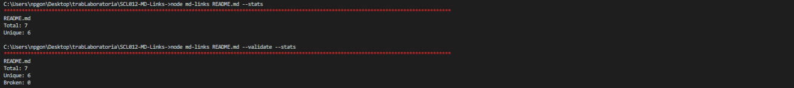
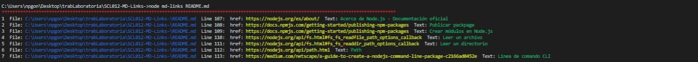
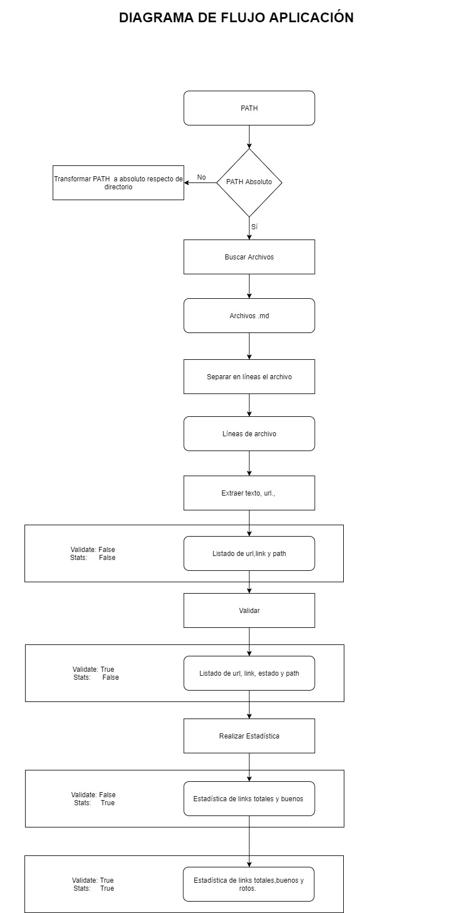

# Proyecto SCL012-MD-Links

## Librería [npgvmd-links](https://www.npmjs.com/package/npgvmd-links)

md-links(path, options), es una librería que busca y analiza, en archivos con extensión ".md" las url's existentes y el texto que les acompaña.

#### Argumentos

* `path`: Ruta absoluta o relativa al archivo o actual directorio ( _current working directory_).
* `options`:

    `--validate`:
    Devuelve por consola un listado con:

  -    File: ruta absoluta del archivo .md que se leyó,
  -    href: url encontrada
  -    Status: "ok" o "failed"
  -    Status Code: código de status - destacando en rojo las url's rotas -
  -    Text: texto que acompaña a url
  -    Line: número de línea dentro del archivo de procedencia
  -    Se destaca en color rojo aquellas url's que no están rotas

    

    `-- stats`:
     Devuelve  por consola:
  -    Total de url's encontradas (Total)
  -    Número de url's únicas encontradas (Unique)

    `--validate` `--stats`:
      Devuelve  por consola:
  -    Total de url's encontradas (Total)
  -    Total de url's únicas encontradas (Unique)
  -    Total de url's rotas (Broken)

    

  Sin selección de las opciones anteriores.

    Devuelve por consola un listado con:

  -    File: ruta absoluta del archivo .md que se leyó,
  -    href: url encontradas
  -    Text: texto que acompaña a url
  -    Line: número de línea dentro del archivo de procedencia

    

## Alcances de md-links
[1] Lee sólo archivos con extensión ".md"

[2] Si no se escribe el "path", lee y analiza todos los archivos que se encuentren en el directorio donde se ejecuta.

## Instalación y Modo de empleo de mdLinks
### Pre - requisitos
#### - Tener instalado node.js
####  Instalar en el computador de forma global las siguientes librerías
* $ npm install node-fetch -g
* $ npm install chalk install chalk -g
* $ npm install minimist -g

### Instalación de librería mdLinks

### Modo de empleo

* Para obtener los links, escribe el comando:

   node md-links < ruta de tu archivo>

* Para usar la opción "--validate" escribe lo siguiente:

  node md-links < ruta de tu archivo> --validate

* Para usar la opción "--stats" escribe lo siguiente:

  node md-links < ruta de tu archivo> --validate

* Para usar las opciones "--validate y "--stats", al mismo tiempo escribe lo siguiente:

  node md-links < ruta de tu archivo> --validate --stats

* Si quieres analizar todos tus archivos .md existentes en tu directorio actual no ingreses el path; de igual modo, sí puedes usar las opciones antes mencionadas

## Próxima Versión
En la próxima versión se espera incluir testeo  de las funciones.

## Diagrama de flujo

## Herramientas utilizadas
* Java Script
* node.js
* npm

## Documentación utilizada
* [Acerca de Node.js - Documentación oficial](https://nodejs.org/es/about/)
* [Publicar packpage](https://docs.npmjs.com/getting-started/publishing-npm-packages)
* [Crear módulos en Node.js](https://docs.npmjs.com/getting-started/publishing-npm-packages)
* [Leer un archivo](https://nodejs.org/api/fs.html#fs_fs_readfile_path_options_callback)
* [Leer un directorio](https://nodejs.org/api/fs.html#fs_fs_readdir_path_options_callback)
* [Path](https://nodejs.org/api/path.html)
* [Linea de comando CLI](https://medium.com/netscape/a-guide-to-create-a-nodejs-command-line-package-c2166ad0452e)
